## Backend Engineer • Go & Java/Spring • Microservices

- Focus: APIs, distributed systems, performance & reliability  
- Principles: Clean Architecture, Clean Code, SOLID, best practices

## Tech

  
  
  
  
  
  
  
  
  

## Selected projects

<table>
  <tr>
    <td>
      
    </td>
    <td>
      
    </td>
  </tr>
  <tr>
    <td>
      
    </td>
    <td>
      
    </td>
  </tr>
</table>
